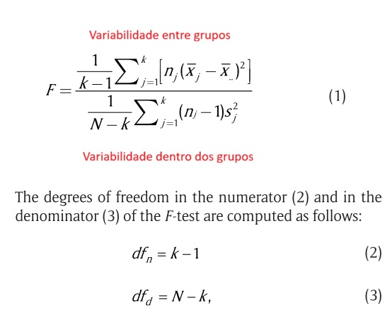
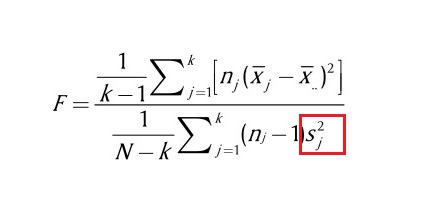
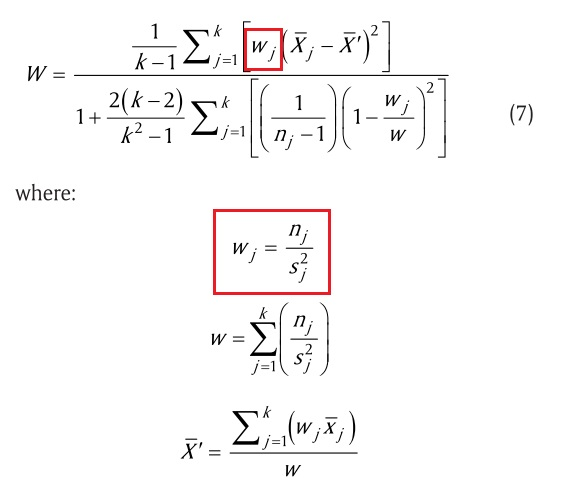
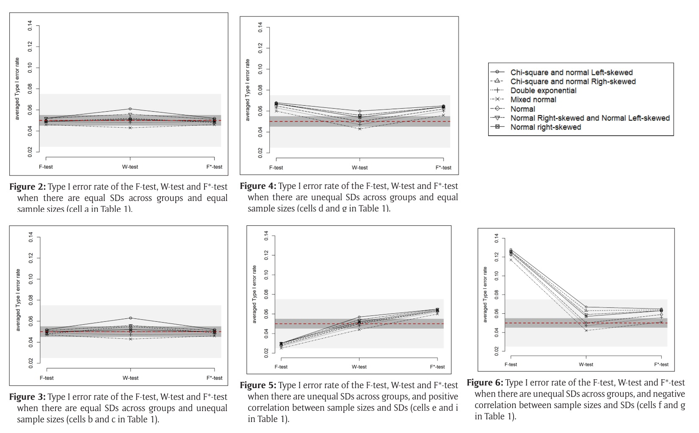
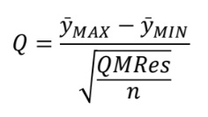
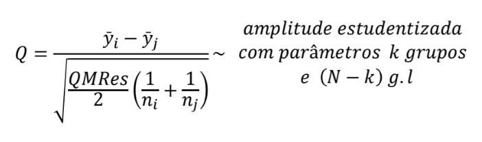
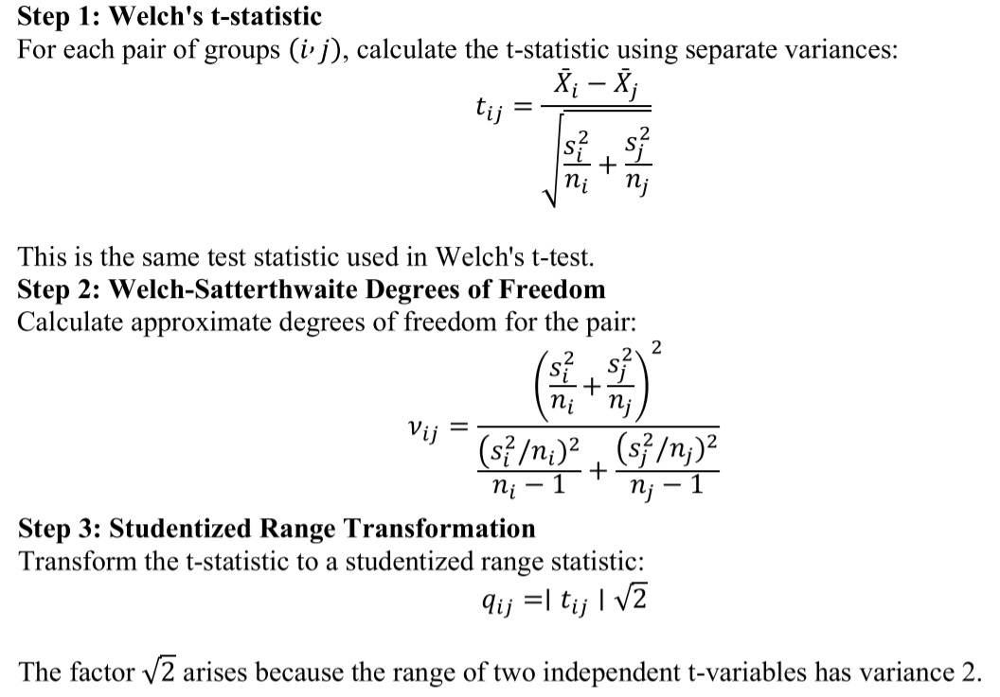

## ANOVA Clássica

-   **Análise de variância com um fator:** avalia se uma variável independente tem efeito sobre uma variável de interesse, através da comparabilidade de médias entre mais de duas populações (Ex: tipos de máquinas A, B e C aceleram a produção média de um determinado produto).
-   **Suposições:** amostras independentes, distribuição normal e variâncias iguais.

$$ H_{0}: \mu_{1} = \mu_{2} = ... = \mu_{n} $$
$$ H_{1}: \mu_{i} \neq \mu_{j}, \quad \text{para algum par (i,j)}$$ 

## Suposições de Normalidade e Homocedasticidade

::: caixa-formula
Delacre, M., et al. (2019). Taking Parametric Assumptions Seriously: Arguments for the Use of Welch’s F-test instead of the Classical F-test in One-Way ANOVA. International Review of Social Psychology, 32(1): 13, 1–12.
:::

- Em muitas áreas de estudo, a suposição de normalidade não se sustenta. Ex: pode haver uma distribuição assimétrica na pontuação de uma escala de bem-estar aplicada em uma população porque há menos pessoas com depressão.
- Homogeneidade de variâncias também é improvável em muitos contextos. Ex: Impacto da estrutura da linguagem nas percepções sociais.

## Teste F da ANOVA Clássiva

## Teste F da ANOVA Clássica

- Se a amostra de maior tamanho tiver maior variância, o valor do denominador aumenta e o valor do teste-F diminui -- **menos resultados significativos**.
- Se a amostra de maior tamanho tiver menor variância, o valor do denominador diminui e o valor do teste-F aumenta -- **mais resultados significativos**.

## ANOVA de Welch{.smaller}

- Ponderada pela razão entre tamanho da amostra e sua variância
- Indicada para comparação entre populações de variâncias desiguais

## Metodologia do estudo

- 2560 cenários criados por simulação Monte Carlo em que as médias entre grupos são iguais para analisar proporção do erro do tipo I (alfa = 5%).
- Cinco condições:

:::caixa-formula
- Tamanho n e DP iguais
- Tamanho n diferentes e DP iguais
- Tamanho n iguais e DP diferentes
- Tamanho n e DP diferentes (correlação positiva)
- Tamanho n e DP diferentes (correlação negativa)
:::

## Resultados do estudo

## Conclusão do estudo

- Teste-F clássico é mais eficiente quando os DP são iguais, embora o teste-F de Welch não ultrapasse tanto a proporção de 5% do erro do tipo I.
- Na violação de homocedasticidade o teste-F de Welch é mais eficiente.

::: fonte
Delacre, M., et al. (2019). Taking Parametric Assumptions Seriously: Arguments for the Use of Welch’s F-test instead of the Classical F-test in One-Way ANOVA. International Review of Social Psychology, 32(1): 13, 1–12.
:::

##  {background-image="est.jpg" background-size="cover" background-position="center" background-opacity="0.30" background-color="#0b3d63"}

::: secao-titulo
Testes de Comparações Múltiplas
:::

::: secao-linha
:::

## Teste de Tukey

- Utilizado para comparações entre pares de médias para avaliar quais grupos estão diferindo significativamente após rejeição da hipótese nula na ANOVA Clássica.
- **Suposição mais importante:** homogeneidade das variâncias.

$$ H_{0}: \mu_{i} = \mu_{j} $$
$$ H_{1}: \mu_{i} \neq \mu_{j}, \quad \text{para todos os possíveis pares (i,j)}$$  

## Distribuição da amplitude estudentizada{.smaller}

- Amostras de tamanhos **iguais**:

- Amostras de tamanhos **diferentes**:

::: fonte
**Moraes, J.R. Notas de aula de Inferência I. Niterói, 2026.**
:::

## Teste Games-Howell

:::caixa-formula
Games, P. A., and Howell, J. F. (1976). Pair wise multiple comparison procedures with unequal n's and/or variances. Journal of Educational Statistics, 1:13-125.
:::

- Teste de Tukey mantem a proporção de erro do tipo I = 5% para toda a "família".
- No entanto, a heterogeneidade de variâncias mostrou-se um problema, principalmente com tamanhos de amostra distintos

## Transformação para o teste de Games-Howell

::: fonte
Allam, I. M. A. (pre-print). Games-Howell Test: A Comprehensive C Implementation for Multiple Comparisons with Heterogeneous Variances.
:::

## Uso do teste de Games-Howell

:::caixa-formula
- **Vantagens:**
- Controla a proporção de erro com tamanhos de amostra diferentes e variâncias desiguais.
- Robusto para a não-normalidade.
- **Desvantagens:**
- Pode ser muito liberal com amostras pequenas (n < 15).
- Alfa pode exceder 5% quando graus de liberdade são pequenos.
:::

:::fonte
Shingala MC, Rajyaguru A. 2015. Comparison of post hoc tests for unequal
variance. Int J New Technol Sci Eng, 2(5):22–33.
:::

##  {background-image="est.jpg" background-size="cover" background-position="center" background-opacity="0.30" background-color="#0b3d63"}

::: secao-titulo
Obrigado
:::

::: secao-linha
:::

::: secao-contato
::: contato-coluna
**Gabriel Gonçalves**

[g_goncalves\@id.uff.br](mailto:g_goncalves@id.uff.br)

[github.com/Gonbriel](https://github.com/Gonbriel)
:::

::: contato-coluna
**Olga Grichtchouk**

[ogrichtchouk\@id.uff.br](mailto:ogrichtchouk@id.uff.br)

[github.com/Olgagg93](https://github.com/Olgagg93)
:::
:::
